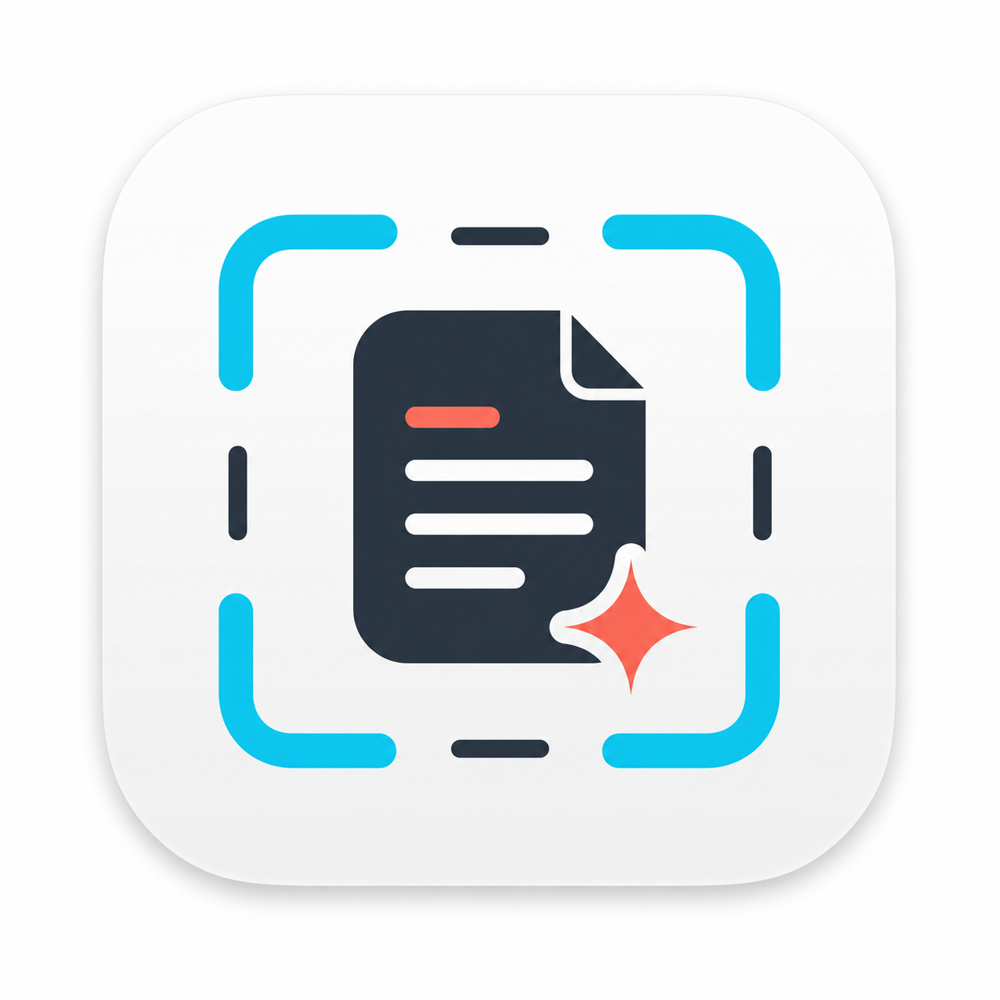

<p align="center">
  
</p>

<h1 align="center">SnapNook</h1>

<p align="center">
  <strong>轻量、原生、极速的 macOS 菜单栏智能截图与长截图工具</strong>
</p>

<p align="center">
  
  
  
  
  
</p>

---

## 📖 项目简介

**SnapNook** 是一款专为 macOS 设计的轻量级原生菜单栏截图利器。采用纯 Swift 编写，基于 AppKit 与 SwiftUI 混合架构打造，常驻 macOS 顶部菜单栏（`LSUIElement = true`）。

致力于提供类似 CleanShot X 般平滑顺畅的使用体验，但保持极低的系统资源开销与零冗余逻辑。从日常区域框选、超长网页垂直滚动截屏，到高精度本地离线 OCR 文字识别与无损标注编辑，SnapNook 均能一气呵成。

---

## ✨ 核心特性

### 📸 精准实时区域截图 (Capture Area)
* **实时无冻结选区**：框选过程中背景不冻结、不暗化，完整保留屏幕原生真实画面与悬浮 Tooltip 提示。
* **高精度像素辅助**：极简短十字准星，实时展示像素级坐标与截取尺寸（靠近屏幕边缘自动智能翻折）。
* **便捷修饰键交互**：
  * 按住 `Shift`：锁定正方形选区等比截取；
  * 按住 `Space`：任意平移移动当前选区；
  * 按下 `ESC`：随时无感退出截屏。
* **无干扰捕获**：截取瞬间自动隐藏 Overlay 选区框，保证截取的图片干净纯粹。

### 📜 滚动长截屏 (Scrolling Capture)
* **现代流式引擎**：基于 Apple 官方现代底层 `ScreenCaptureKit`，以 30 FPS 极速捕获内容画面。
* **交互式自由选区**：支持当前屏幕内拖拽选区并提供 8 点手柄精准微调，轻松排除页面固定导航栏与侧边栏。
* **多级可靠拼接算法 (`ScrollingStitcher`)**：
  * 缩小灰度粗搜 + 原图逐行精搜，确保像素级无缝拼接；
  * 智能回滚防重：向上滑动回看不重复拼接，向下滑动超越末端锚点才追加新内容；
  * 容错恢复机制与超限保护（单张支持最高 64,000,000 像素安全合成）。
* **实时侧边长图预览**：实时展示长图拼接进度与当前总高度，点击 `Done` 立即完成并进入后续流程。

### 🔍 离线 OCR 文字识别 (Capture Text)
* **本地神经识别**：基于 Apple 官方 Vision 框架（`VNRecognizeTextRequest`）本地离线执行，零数据外传，极致隐私安全。
* **开箱即用**：框选屏幕任意区域文字后，自动提取并智能清洗换行与空格，直接写入系统剪贴板。
* **中英双语优化**：专门适配 `zh-Hans` 与 `en-US` 混合文本。
* **极简 HUD 反馈**：识别中、复制成功、无文本等状态均通过轻量级无感 Toast 提示。

### 🎨 无损标注截图编辑器 (Editor & Annotation)
* **原图坐标系体系**：所有标注基于原始图片分辨率与 `CanvasTransform`，导出渲染锐利清晰，杜绝拉伸模糊。
* **丰富标注工具箱**：
  * **基础工具**：选择移动 (`Select`)、自由裁剪 (`Crop`)、高品质文字输入 (`Text`)、箭头指示 (`Arrow`)、几何矩形 (`Rectangle`)；
  * **视觉与隐私滤镜**：
    * 聚光灯高亮 (`Highlight`)：选区保持高亮，外部自然暗化，聚焦关键视觉中心；
    * 高斯模糊 (`Blur`)：局部敏感信息模糊脱敏；
    * 局部马赛克 (`Mosaic`)：经典方块像素打码。
* **撤销与重做**：完备的 `Undo / Redo` 历史记录栈。

### 🪟 浮动缩略图与快速流转 (Floating Preview)
* 截图完成后在屏幕左下角弹出无焦点浮动预览卡片。
* 支持鼠标悬浮快捷操作：
  * 📋 **Copy**：一键将图片复制到系统剪贴板；
  * 💾 **Save**：唤起文件保存面板导出 PNG；
  * ✏️ **Edit**：直接载入全功能截图编辑器进行修图；
  * ❌ **Close**：关闭并销毁预览。

### ⌨️ 全局快捷键与偏好设置 (Preferences)
* 集成 `sindresorhus/KeyboardShortcuts`，支持用户随心自定义全局触发键。
* **默认快捷键**：
  * 区域截图：`⌥ + ⇧ + S` (`Option + Shift + S`)
  * OCR 文字识别：可在偏好设置中自由配置
* 菜单栏常驻图标，随时右键唤起控制菜单。

---

## 🛠️ 技术栈与依赖

* **开发语言**：Swift 5.9+
* **最低支持系统**：macOS 13.0 (Ventura) 及以上
* **UI 体系**：AppKit (负责无边框非激活窗口、多屏管理、底层事件监听) + SwiftUI (偏好设置及部分组件)
* **系统框架**：
  * `ScreenCaptureKit`：高帧率无损屏幕录制与长截屏流
  * `Vision`：离线高性能光学字符识别 (OCR)
  * `CoreGraphics` / `ImageIO`：像素操作、坐标变换与 PNG 编码
  * `Carbon`：全局 Escape 监听与底层事件拦截
* **第三方依赖**：
  * [`sindresorhus/KeyboardShortcuts`](https://github.com/sindresorhus/KeyboardShortcuts) (v2.4.0+)：原生全局快捷键录制与响应

---

## 📂 项目结构

```text
SnapNook/
├── Package.swift                     # SwiftPM 包配置与依赖
├── Resources/
│   ├── Info.plist                    # App Bundle 元数据 (LSUIElement=true)
│   ├── SnapNook.icns                 # 高清应用图标
│   ├── SnapNookLogo-v2.png           # 项目 Logo
│   └── SnapNookMenuBarTemplate.png   # 菜单栏黑白自适应图标
├── Sources/
│   └── SnapNook/
│       ├── main.swift                # 程序入口
│       ├── AppDelegate.swift         # 生命周期与菜单栏装配
│       ├── StatusItemController.swift# 菜单栏下拉项
│       ├── CaptureCoordinator.swift  # 核心截图业务状态机
│       ├── CaptureOverlayController.swift # 全屏透明选区 Overlay
│       ├── ScreenCapturer.swift      # 屏幕元数据提取与像素裁切
│       ├── ScreenCapturePermissionService.swift # 屏幕录制权限检测与引导
│       ├── ScreenshotPreviewController.swift   # 左下角浮动缩略图生命周期
│       ├── ToastController.swift     # 轻量 HUD 提示
│       ├── OCRService.swift          # 本地 Vision OCR 引擎
│       ├── Editor/                   # 截图编辑器全套组件
│       │   ├── EditorCanvasView.swift# 绘图画布与触控响应
│       │   ├── AnnotationRenderer.swift # 标注渲染引擎
│       │   ├── ImageEffectProcessor.swift # 模糊/马赛克/高光效果
│       │   └── UndoRedoManager.swift # 撤销重做管理
│       └── ScrollingCapture/         # 滚动长截屏模块
│           ├── ScrollingCaptureStream.swift   # ScreenCaptureKit 流捕获
│           ├── ScrollingStitcher.swift        # 多级长图缝合拼接算法
│           └── ScrollingPreviewPanel.swift    # 侧边长图实时预览面板
├── Tests/
│   └── SnapNookTests/                # 单元测试 (含拼接算法与 OCR 测试)
├── scripts/
│   └── build_app.sh                  # 一键编译与打包 .app 脚本
└── docs/                             # 完备的开发架构与维护文档
```

---

## 🚀 编译与构建

### 1. 准备开发环境
* 确保安装了 Xcode 15+ 或相应版本的 Command Line Tools。
* macOS 13.0 或更高版本系统。

### 2. 克隆仓库
```bash
git clone https://github.com/poer-pap/SnapNook.git
cd SnapNook
```

### 3. 一键编译与打包 (.app)
项目提供了便捷的打包脚本，自动处理 SwiftPM 编译、资源文件与 Bundles 拷贝及代码自签名：

```bash
# Debug 模式快速构建
bash scripts/build_app.sh

# 或构建 Release 生产版本
bash scripts/build_app.sh release
```

构建成功后，将在 `.build/SnapNook.app` 生成完整的独立应用包。您可以将其移动到 `/Applications` 文件夹下直接启动。

### 4. 运行单元测试
```bash
swift test
```

---

## 🔐 权限配置说明

由于 SnapNook 是一款深入系统底层的截图工具，首次使用时需要以下系统权限：

1. **屏幕录制权限 (Screen Recording)**：
   * 用于捕获屏幕像素及使用 ScreenCaptureKit 进行滚动捕获。
   * 首次启动时若未授权，应用会自动弹出系统设置引导窗口。
2. **辅助功能权限 (Accessibility)**（推荐）：
   * 用于在截图框选期间对鼠标与键盘事件进行会话内拦截，防止截图框选时误触背景网页或桌面应用，并在退出选区后即时释放。

---

## 🤝 贡献与开发规范

欢迎任何 Issue 反馈与 Pull Request！
在修改代码或提交贡献前，请先查阅以下文档以保持架构设计的一致性：
* [AGENTS.md](AGENTS.md)：AI 编码与贡献核心规则约束
* [docs/PROJECT_NOTES.md](docs/PROJECT_NOTES.md)：架构设计哲学与模块约束
* [docs/SCROLLING_CAPTURE.md](docs/SCROLLING_CAPTURE.md)：长截屏技术实现细节
* [docs/TESTING.md](docs/TESTING.md)：手动验证清单与测试用例

---

## 📄 开源许可证

本项目基于 MIT License 开源。欢迎 Star ⭐️ 与共同建设！
